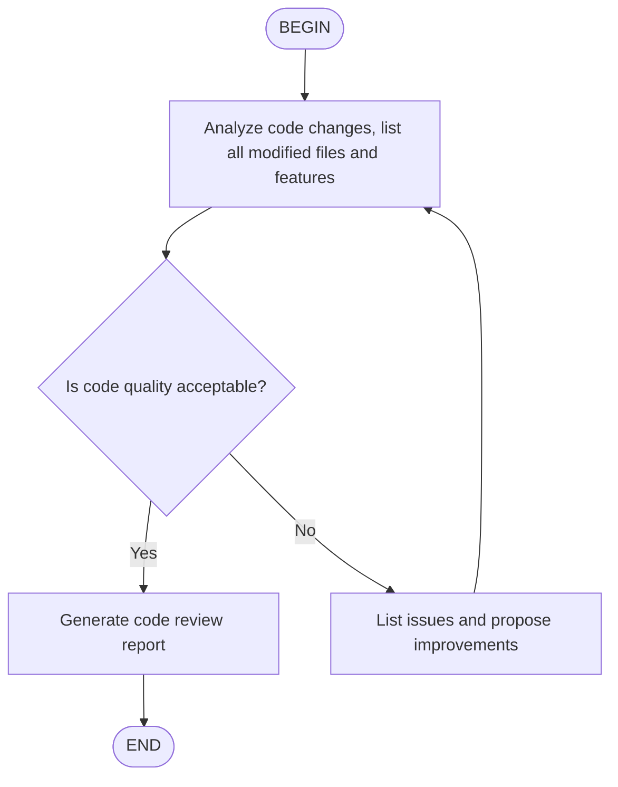

# Agent Skills

Agent Skills is an open format for adding specialized knowledge and workflows to AI agents. axe supports loading Agent Skills to extend AI capabilities.

## What are Agent Skills?

A skill is a directory containing a `SKILL.md` file. When axe starts, it discovers all skills and injects their names, paths, and descriptions into the system prompt. The AI will decide on its own whether to read the specific SKILL.md file to get detailed guidance based on the current task's needs.

For example, you can create a "code style" skill to tell the AI your project's naming conventions, comment styles, etc.; or create a "security audit" skill to have the AI focus on specific security issues when reviewing code.

## Skill discovery

axe uses a layered loading mechanism to discover skills, loading in the following priority order (later ones override skills with the same name):

**Built-in skills**

Skills shipped with the package, providing basic capabilities.

**User-level skills**

Stored in the user's home directory, effective across all projects. axe checks the following directories in priority order and uses the first one that exists:

- `~/.config/agents/skills/` (recommended)
- `~/.agents/skills/`
- `~/.axe/skills/`
- `~/.claude/skills/`
- `~/.codex/skills/`

**Project-level skills**

Stored in the project directory, only effective within that project's working directory. axe checks the following directories in priority order and uses the first one that exists:

- `.agents/skills/` (recommended)
- `.axe/skills/`
- `.claude/skills/`
- `.codex/skills/`

You can also specify other directories with the `--skills-dir` flag, which skips user-level and project-level skill discovery:

```bash
axe --skills-dir /path/to/my-skills
```

### Built-in skills

axe includes the following built-in skills:

- **axe-cli-help**: axe CLI help. Answers questions about axe installation, configuration, slash commands, keyboard shortcuts, MCP integration, providers, environment variables, and more.
- **skill-creator**: Guide for creating skills. When you need to create a new skill (or update an existing skill) to extend axe's capabilities, you can use this skill to get detailed creation guidance and best practices.

## Creating a skill

Creating a skill only requires two steps:

1. Create a subdirectory in the skills directory
2. Create a SKILL.md file in the subdirectory

**Directory structure:**

A skill directory needs at least a SKILL.md file, and can also include auxiliary directories to organize more complex content:

```
~/.config/agents/skills/
└── my-skill/
    ├── SKILL.md          # Required: main file
    ├── scripts/          # Optional: script files
    ├── references/       # Optional: reference documents
    └── assets/           # Optional: other resources
```

**SKILL.md format:**

SKILL.md uses YAML frontmatter to define metadata, followed by prompt content in Markdown format:

```yaml
---
name: code-style
description: My project's code style guidelines
---

## Code Style

In this project, please follow these conventions:

- Use 4-space indentation
- Variable names use camelCase
- Function names use snake_case
- Every function needs a docstring
- Lines should not exceed 100 characters
```

**Frontmatter fields:**

| Field | Description | Required |
|-------|-------------|----------|
| name | Skill name, 1-64 characters, only lowercase letters, numbers, and hyphens allowed; defaults to directory name if omitted | No |
| description | Skill description, 1-1024 characters, explaining the skill's purpose and use cases; shows "No description provided." if omitted | No |
| license | License name or file reference | No |
| compatibility | Environment requirements, up to 500 characters | No |
| metadata | Additional key-value attributes | No |

**Best practices:**

- Keep SKILL.md under 500 lines, move detailed content to scripts/, references/, or assets/ directories
- Use relative paths in SKILL.md to reference other files
- Provide clear step-by-step instructions, input/output examples, and edge case explanations

### Example skills

**PowerPoint creation:**

```yaml
---
name: pptx
description: Create and edit PowerPoint presentations
---

## PPT Creation Workflow

When creating presentations, follow these steps:

1. Analyze content structure, plan slide outline
2. Choose appropriate color scheme and fonts
3. Use python-pptx library to generate .pptx files

## Design Principles

- Each slide focuses on one topic
- Keep text concise, use bullet points instead of long paragraphs
- Maintain clear visual hierarchy with distinct titles, body, and notes
- Use consistent colors, avoid more than 3 main colors
```

**Python project standards:**

```yaml
---
name: python-project
description: Python project development standards, including code style, testing, and dependency management
---

## Python Development Standards

- Use Python 3.14+
- Use ruff for code formatting and linting
- Use pyright for type checking
- Use pytest for testing
- Use uv for dependency management

Code style:
- Line length limit 100 characters
- Use type annotations
- Public functions need docstrings
```

**Git commit conventions:**

```yaml
---
name: git-commits
description: Git commit message conventions using Conventional Commits format
---

## Git Commit Conventions

Use Conventional Commits format:

type(scope): description

Allowed types: feat, fix, docs, style, refactor, test, chore

Examples:
- feat(auth): add OAuth login support
- fix(api): fix user query returning null
- docs(readme): update installation instructions
```

## Using slash commands to load a skill

The `/skill:<name>` slash command lets you save commonly used prompt templates as skills and quickly invoke them when needed. When you enter the command, axe reads the corresponding SKILL.md file content and sends it to the Agent as a prompt.

For example:

- `/skill:code-style` - Load code style guidelines
- `/skill:pptx` - Load PPT creation workflow
- `/skill:git-commits fix user login issue` - Load Git commit conventions with an additional task description

You can append additional text after the slash command, which will be added to the skill prompt as the user's specific request.

**TIP:** For regular conversations, the Agent will automatically decide whether to read skill content based on context, so you don't need to invoke it manually.

Skills allow you to codify your team's best practices and project standards, ensuring the AI always follows consistent standards.

## Flow skills

Flow skills are a special skill type that embed an Agent Flow diagram in SKILL.md, used to define multi-step automated workflows. Unlike standard skills, flow skills are invoked via `/flow:<name>` commands and automatically execute multiple conversation turns following the flow diagram.

**Creating a flow skill:**

To create a flow skill, set `type: flow` in the frontmatter and include a Mermaid or D2 code block in the content:

```yaml
---
name: code-review
description: Code review workflow
type: flow
---


```

**Flow diagram format:**

Both Mermaid and D2 formats are supported:

- **Mermaid**: Use ` ```mermaid ` code block, [Mermaid Playground](https://mermaid.live) can be used for editing and preview
- **D2**: Use ` ```d2 ` code block, [D2 Playground](https://play.d2lang.com) can be used for editing and preview

Flow diagrams must contain one BEGIN node and one END node. Regular node text is sent to the Agent as a prompt; decision nodes require the Agent to output `<choice>branch name</choice>` in the output to select the next step.

**Executing a flow skill:**

Flow skills can be invoked in two ways:

- `/flow:<name>` - Execute the flow. The Agent will start from the BEGIN node and process each node according to the flow diagram definition until reaching the END node
- `/skill:<name>` - Like a standard skill, sends the SKILL.md content to the Agent as a prompt (does not automatically execute the flow)

```bash
# Execute the flow
/flow:code-review

# Load as a standard skill
/skill:code-review
```
